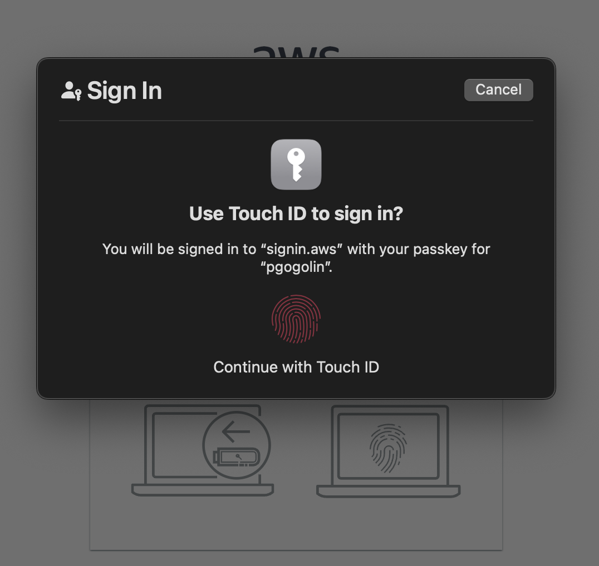
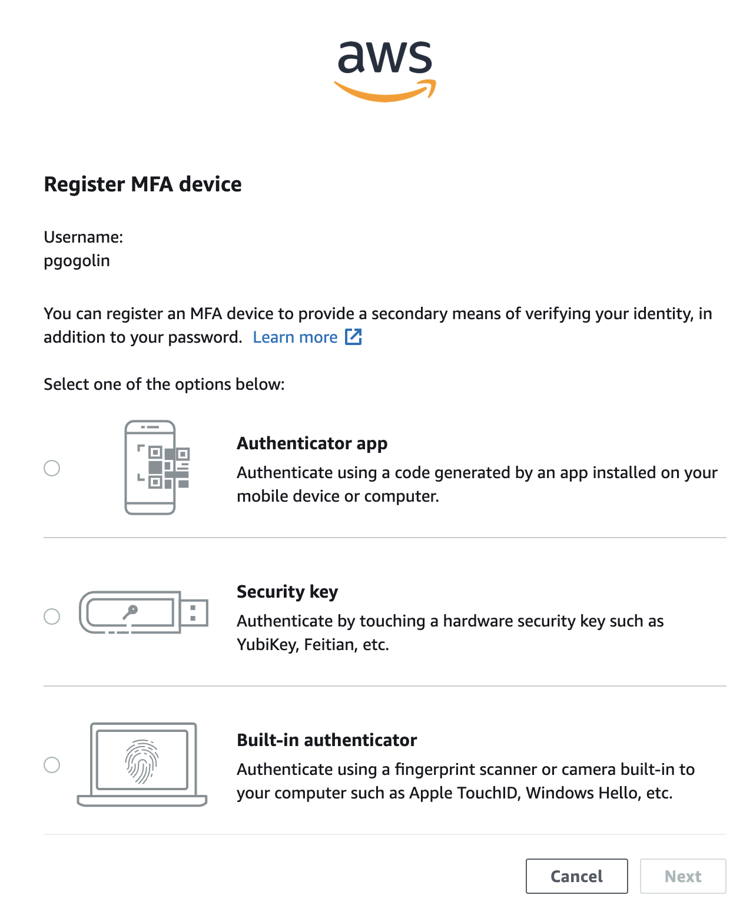

# AWS SSO on macOS

In this tutorial I use the Google Chrome browser only for its profile feature. The same can be achieved with Safari using the default profile.


## Steps

Steps to keep your environment authenticated.


### Browser

First, I prefer to sign in to the **AWS Access Portal**. I'll use the fingerprint scanner.

<div style="width:50%;">


</div>

To get this I registered Built-in authenticator before. The link to the MFA Devices page is in the drop-down menu on your profile icon (top right).

<div style="width:50%;">


</div>

### SSO

According to the AWS doc: [Configure SSO Wizard](https://docs.aws.amazon.com/cli/latest/userguide/cli-configure-sso.html#cli-configure-sso-configure), run the `aws configure sso` command if you haven't already done so **OR** manually edit the `~/.aws/config` file.


It will add to your `~/.aws/config` section like this:
```conf
[profile company123-production-virginia]
sso_start_url=https://company123.awsapps.com/start
sso_account_id=123123123123
sso_role_name=Company123AdministratorAccess
sso_region=eu-west-1
region=us-east-1
```

Then you can execute `sso login` command:

Use the `--no-browser` option to use a non-default browser. Then copy and paste the link into the correct authenticated profile on the web browser.

```sh
aws sso login --profile company123-production-virginia --no-browser
```
Click buttons *Confirm* and *Allow* 

Then you are authenticated

```
Successfully logged into Start URL: https://company123.awsapps.com/start
```

### Access from the terminal

You are now ready to connect to AWS resources from your terminal, but first you need to choose which profile to use. 

I recommend using the `aws-vault` tool if you want to work with many environments at the same time. Other way is to set `env` variables for current.

```sh
export AWS_PROFILE=company123-production-virginia                                   
export AWS_DEFAULT_PROFILE=company123-production-virginia
export AWS_SDK_LOAD_CONFIG=1
export ENVIRONMENT=production-virginia
```

On the Mac (and not only, because I use it on my linuxes too) the must-have extension in my opinion is [Oh My Zsh](https://ohmyz.sh). Use it!

Thanks to this, I can see the main shell parameters set in my prompt bar. In my case (`ZSH_THEME="agnoster"`) the prompt looks like this.


It was strange to me why the above is in red. I thought I had some misconfigurations. But **OhMyZsh** never ceases to amaze me. It shows yellow on red if the profile name contains `production` or ends in `-prod` :-)

Verify:
```sh
aws sts get-caller-identity
{
    "UserId": "1234QWERASDFZXCVBVASD:pgogolin",
    "Account": "123123123123",
    "Arn": "arn:aws:sts::123123123123:assumed-role/AWSReservedSSO_company123AdministratorAccess_cb123123123123cc/pgogolin"
}
```

If you want to work with Kubernetes cluster in a selected region use the `kubectx` and `kubens` tools for your convenience.

```sh
kubectx                                                              
    [...]
    arn:aws:eks:us-east-1:123123123123:cluster/company123-eks-production-virginia

kubens 
    [...]
    kube-system

kubectl get po                                        
    NAME                                           READY   STATUS 
    aws-load-balancer-controller-1231231231-12345  1/1     Running
    aws-node-12345                                 2/2     Running
    aws-node-23456                                 2/2     Running
    aws-node-34567                                 2/2     Running
```

<style type="text/css">
    img[alt=prompt]{ width: 491px; }
</style>
